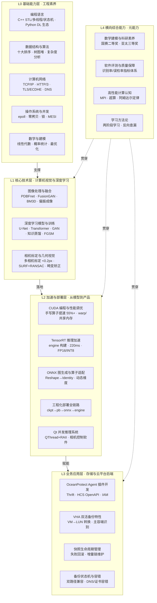

  Knowledge Architecture
  <h1>知识体系</h1>
  
五层能力架构总览。每个技能点都是一个独立页面，可按需持续补充。

  

    40+ 技能点 · 分页承载
    按掌握程度分级
    跨层关联可见
  

## 职业定位

**算法研究（计算机视觉 / 深度学习）→ 推理部署（TensorRT / ONNX / CUDA 加速）→ 存储后端（OceanProtect 备份产品）**，三段经历构成完整的能力闭环。核心优势：不只是训练模型，而是能将模型从论文推到嵌入式实时运行；不只是写业务代码，而是能用算法工程化的思维设计高可靠的后端系统。

## 架构图

## 技能导航

> 掌握程度：实战项目级（完整项目落地 + 量化结果）＞ 动手实践级（写过代码 / 跑通流程）＞ 概念了解级（系统学习 / 工具链掌握）。点击技能名进入对应详情页。

### L0 基础能力层

> 工程师的底层操作系统——决定代码质量、系统理解与问题排查的天花板。→ [[L0编程语言|进入 L0 编程语言]] · [[L0数据结构与算法|数据结构]] · [[L0计算机网络|计算机网络]] · [[L0操作系统与并发|操作系统]] · [[L0数学与建模|数学与建模]]

- **[[L0编程语言|编程语言]]**（实战项目级）— C++/STL/多线程/状态机；Python 深度学习生态
- **[[L0数据结构与算法|数据结构与算法]]**（动手实践级）— 复杂度分析、十大排序、树/图/堆、手写动态扩容栈
- **[[L0计算机网络|计算机网络]]**（概念了解级·有实战）— TCP/IP、HTTP/3、TLS/ECDHE、DNS；IAM 鉴权与 API 容错
- **[[L0操作系统与并发|操作系统与并发]]**（概念了解级·有实战）— 内存管理、epoll、零拷贝、并发锁、状态机实战
- **[[L0数学与建模|数学与建模]]**（实战项目级）— 全国大学生数学建模二等奖

### L1 核心技术层

> 专业纵深——计算机视觉与深度学习的算法研究与工程实现能力。→ [[L1图像处理与融合|进入 L1 图像处理与融合]] · [[L1深度学习模型与训练|深度学习]] · [[L1相机标定与几何视觉|相机标定]]

- **[[L1图像处理与融合|图像处理与融合]]**（实战项目级）— PDBFnet（MG +29.5% / SD +163%）、偏振成像、BM3D CUDA 改造、弱光增强（召回率 +17%）、FusionGAN
- **[[L1深度学习模型与训练|深度学习模型与训练]]**（实战项目级）— U-Net、Transformer、知识蒸馏（1/3 参数 / 时延降 50%）、FGSM、GAN、RAG
- **[[L1相机标定与几何视觉|相机标定与几何视觉]]**（实战项目级）— 多相机联合标定 <0.2px、跨模态配准 <2px、畸变建模、四边形关键点检测

### L2 加速与部署层

> 从实验室到产品的桥梁——让算法在真实硬件上跑得动、跑得快、跑得稳。→ [[L2CUDA编程与性能调优|进入 L2 CUDA]] · [[L2模型压缩与推理加速|压缩加速]] · [[L2ONNX与模型转换|ONNX]] · [[L2工程化部署|工程化部署]]

- **[[L2CUDA编程与性能调优|CUDA 编程与性能调优]]**（动手实践级）— 手写 gather 算子提速 55%+、warp/共享内存/restrict 调优
- **[[L2模型压缩与推理加速|模型压缩与推理加速]]**（实战项目级）— TensorRT 220ms、FP16/INT8、OpenMP+AVX2（1.6 倍）
- **[[L2ONNX与模型转换|ONNX 与模型转换]]**（实战项目级）— 算子改写、动态/静态维度切换、图校验
- **[[L2工程化部署|工程化部署]]**（实战项目级）— ckpt→pb→onnx→engine 全链路、Qt 并发推理系统、多平台部署

### L3 业务应用层

> 技术价值的最终落点——在存储备份产品中解决真实业务问题。→ [[L3存储与云平台后端|进入 L3]]

- **[[L3存储与云平台后端|存储与云平台后端]]**（实战项目级）— OceanProtect Agent、VHA 双活备份、快照生命周期、备份状态机、云接口容错

### L4 横向综合能力

> 贯穿所有层级的元能力——学习力、科研素养、质量意识。→ [[L4横向综合能力|进入 L4]]

- **[[L4横向综合能力|横向综合能力]]**（实战项目级）— 数学建模与科研素养、软件评测、高性能计算认知、学习方法论

## 能力交叉点

> 交叉点不是单一技能，而是多个领域能力的化学反应——代表了「从学习到能力沉淀」的真实成果，也是区别于普通技能清单的核心差异化内容。

### 交叉点 1 · BM3D 去噪的 CUDA 改造
**图像去噪算法 × CUDA 编程 × 性能调优** —— 不满足于 CPU 实现，用 CUDA 重写块匹配内核，并做算法级改进（方差自适应阈值、自适应相似块数），用 SSIM 消融实验量化，形成「算法 → 加速 → 验证」闭环。

### 交叉点 2 · 知识蒸馏 → TensorRT 部署全链路
**模型训练 × 模型压缩 × TensorRT 推理 × 部署验证** —— 完整走通「教师模型 → 蒸馏 → 学生模型 → ONNX → engine → 精度验证」，每一步都有量化对比（节点 5.0 万 vs 27.3 万、engine 4.79s vs 8.87s）。

### 交叉点 3 · 畸变矫正的多级加速
**相机标定 × OpenMP × AVX2 × CUDA** —— 同一算法依次实现基线 C++ → OpenMP → AVX2 → 组合 → GPU，每级加速都有量化（26.36ms → 16.67ms，约 1.6 倍）。

### 交叉点 4 · Qt 并发推理系统
**C++多线程/状态机 × ONNX Runtime × 偏振成像 × 相机控制** —— 构建完整软件产品：多线程并发推理 + 相机硬件控制 + 可视化界面 + RAII 资源安全。

### 交叉点 5 · 存储后端状态机设计
**C++状态机 × 存储业务 × 并发系统经验 × 容错方法论** —— 将算法工程中积累的经验迁移到存储备份系统；双路径兼容设计本质是「向后兼容的状态机扩展」。

### 交叉点 6 · 部署精度验证方法论
**部署全链路 × 软件评测 × 调试能力** —— 建立「固定种子 → 逐级对比 → 误差报告 → 根因定位」的严谨验证流程，方法论直接迁移到后端问题定位。

---
相关页面：[[简历]] · [[index|首页]]
