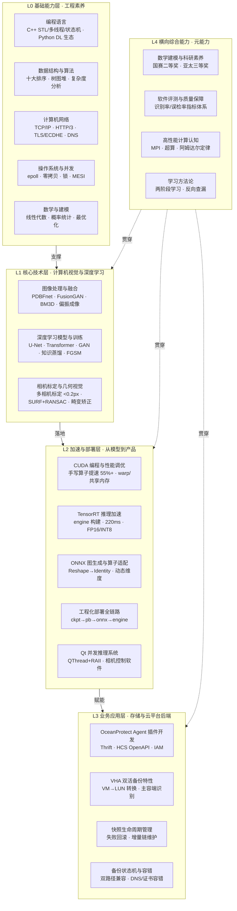

  Knowledge Architecture
  <h1>个人知识体系</h1>
  
从基础能力到业务应用的五层知识架构。研究生阶段沉淀的算法研究与工程落地能力，加上当前存储后端开发的系统设计经验，构成「懂算法原理 → 能工程落地 → 精系统设计」的复合能力曲线。

## 职业定位

**算法研究（计算机视觉 / 深度学习）→ 推理部署（TensorRT / ONNX / CUDA 加速）→ 存储后端（OceanProtect 备份产品）**，三段经历构成完整的能力闭环。核心优势：不只是训练模型，而是能将模型从论文推到嵌入式实时运行；不只是写业务代码，而是能用算法工程化的思维设计高可靠的后端系统。

## 架构总览

| 层级 | 名称 | 一句话定位 |
|---|---|---|
| L0 | 基础能力层 | 工程师的底层操作系统——决定代码质量、系统理解与问题排查的天花板 |
| L1 | 核心技术层 | 专业纵深——计算机视觉与深度学习的算法研究与工程实现能力 |
| L2 | 加速与部署层 | 从实验室到产品的桥梁——让算法在真实硬件上跑得动、跑得快、跑得稳 |
| L3 | 业务应用层 | 技术价值的最终落点——在存储备份产品中解决真实业务问题 |
| L4 | 横向综合能力 | 贯穿所有层级的元能力——学习力、科研素养、质量意识 |

## 架构图

## L0 基础能力层

> 定位：工程师的底层操作系统。这一层不直接产出项目成果，但决定了上层技术的实现质量和排障效率。

### L0.1 编程语言

| 技能 | 掌握程度 | 代表成果 | 关联 |
|---|---|---|---|
| C++ / STL / 多线程 / 状态机 | 实战项目级 | OceanProtect 备份状态机设计；Qt+RAII 资源管理；智能指针、移动语义、STL 底层系统掌握 | → L1 训练框架理解；L2 Qt 并发推理；L3 备份状态机 |
| Python 深度学习生态 | 实战项目级 | TensorFlow / PyTorch 训练与部署全链路脚本；NumPy / OpenCV / PyCUDA / Flask | → L1 模型训练；L2 部署脚本 |

### L0.2 数据结构与算法

| 技能 | 掌握程度 | 代表成果 | 关联 |
|---|---|---|---|
| 数据结构与算法基础 | 动手实践级 | 复杂度分析、数组/链表/栈/队列/哈希表/二叉树/AVL/堆/图、十大排序；手写动态扩容栈 | → L0 C++ 底层理解；L4 数学建模 |

### L0.3 计算机网络

| 技能 | 掌握程度 | 代表成果 | 关联 |
|---|---|---|---|
| TCP/IP / HTTP / TLS / DNS | 概念了解级（有实战应用） | 存储后端中处理 IAM 鉴权、API 容错、DNS / 证书 / 网络抖动边界问题；系统掌握 TCP 三次握手四次挥手、HTTP/3、TLS/ECDHE | → L3 云平台 API 调用与容错 |

### L0.4 操作系统与并发

| 技能 | 掌握程度 | 代表成果 | 关联 |
|---|---|---|---|
| 操作系统 / 并发编程 | 概念了解级（有实战应用） | 内存管理、epoll、零拷贝、互斥/读写/自旋锁、死锁避免；多线程任务状态机实战 | → L2 CUDA 并发模型；L3 后端并发设计 |

### L0.5 数学与建模

| 技能 | 掌握程度 | 代表成果 | 关联 |
|---|---|---|---|
| 数学建模 | 实战项目级 | 全国大学生数学建模二等奖、亚太地区数学建模三等奖、江西省数学竞赛三等奖 | → L1 图像评价指标设计；L4 科研素养 |

## L1 核心技术层

> 定位：专业纵深。研究生阶段的核心产出区——从偏振成像物理链路到深度学习模型，再到相机标定几何视觉，构成完整的计算机视觉能力矩阵。

### L1.1 图像处理与融合

| 技能 | 掌握程度 | 代表成果 | 关联 |
|---|---|---|---|
| PDBFnet 双分支特征融合网络 | 实战项目级 | 偏振图像清晰度显著提升：平均梯度（MG）+29.5%、标准差（SD）+163% | → L1.2 训练；L2 蒸馏/部署对象 |
| 偏振成像链路 | 实战项目级 | 四方向 RAW（90/135/45/0°）→ Stokes s0/s1/s2 → DOP 全链路计算 | → PDBFnet 融合输入；L1.3 偏振标定 |
| BM3D 去噪 CUDA 改造 | 实战项目级 | 方差自适应阈值 + 自适应相似块数两条改进路线；warp 并行 + 共享内存 + 插入排序；SSIM 三组内核消融 | **= 图像去噪 × CUDA 编程 × 性能调优的交叉点** |
| 弱光图像增强（U-Net + Transformer） | 实战项目级 | U-Net 亮度调整 + Transformer 色彩校正；检测召回率提升 17% | → L1.2 U-Net/Transformer；专利受理 |
| FusionGAN 红外-可见光融合 | 动手实践级 | 生成对抗融合；熵 12.513、平均梯度 39.560；参数 135.8 万 → 92.6 万 | → GAN 训练；ONNX 导出；跨模态配准 |
| 自适应权重融合 / 稀疏字典融合 | 动手实践级 | 熵权重、Sobel 梯度权重三种方案对比；K-SVD / OMP 稀疏表示 | → L0.5 线性代数 |
| 融合图像定量评价体系 | 动手实践级 | 信息熵、平均梯度、手写 PSNR、SSIM；识别率/误检率/漏检率 | → L4 软件评测 |

### L1.2 深度学习模型与训练

| 技能 | 掌握程度 | 代表成果 | 关联 |
|---|---|---|---|
| U-Net 关键点 / 分割模型 | 实战项目级 | 四边形关键点检测（相机-投影仪标定光卡）；自制大规模数据集训练 | → L1.3 关键点检测；FGSM 对抗训练 |
| Transformer 色彩 / 特征建模 | 实战项目级 | 弱光增强颜色修正；self-attention、位置编码 | → L1.1 弱光增强 |
| 知识蒸馏 | 实战项目级 | 参数量压至 1/3、时延降 50%；学生/教师节点 5.0 万 vs 27.3 万，engine 提速约 46% | **= 模型训练 × 模型压缩 × TensorRT 部署的链路点** |
| 对抗训练（FGSM） | 实战项目级 | 提升检测在动态 / 遮挡 / 过曝场景鲁棒性 | → U-Net 检测 |
| GAN 训练与稳定性 | 动手实践级 | 谱归一化判别器手写、损失权重调参、NaN 逐层定位 | → FusionGAN |
| 数据集增强与标注规范 | 实战项目级 | 双模态数据集标注规则、数据增强提升鲁棒性 | → 数据工程 |
| 大模型本地应用与 RAG | 动手实践级 | Qwen1.5-1.8B 本地部署 + Flask 服务 + RAG 检索增强；LoRA / ReAct 为规划方向 | → Python/Flask |

### L1.3 相机标定与几何视觉

| 技能 | 掌握程度 | 代表成果 | 关联 |
|---|---|---|---|
| 多相机联合标定（可见光/红外/偏振） | 实战项目级 | 联合标定误差 < 0.2px；红外相机重投影误差 0.22 ~ 0.32px | → 畸变矫正；OpenCV-CUDA |
| 跨模态特征匹配与配准 | 实战项目级 | SURF + RANSAC + Lowe 比率测试，对齐误差 < 2px | → FusionGAN 融合前置 |
| 镜头畸变建模与去畸变 | 实战项目级 | Brown-Conrady 反向映射 + 双线性插值，MATLAB → C++/OpenCV 移植；GPU 校正 | **= 几何视觉 × CUDA × CPU SIMD 的交叉点** |
| 四边形关键点检测 | 实战项目级 | Gamma/Otsu/形态学预处理 + 凸性/面积/平行度约束 + 遮挡角点恢复 + U-Net + FGSM | → 相机-投影仪标定应用 |
| 仿射 / 透视变换 | 动手实践级 | 复合矩阵、perspectiveTransform、warpPerspective 融合 | → 配准；OpenMP/AVX2 |
| OpenCV CUDA 视觉加速 | 动手实践级 | SURF_CUDA、CLAHE、Canny、GpuMat 加速 | → CUDA |

## L2 加速与部署层

> 定位：从实验室到产品的桥梁。区分「会训练模型」和「能交付产品」的关键——形成了模型压缩 → 推理加速 → 多平台部署 → 并发系统的完整能力链。

### L2.1 CUDA 编程与性能调优

| 技能 | 掌握程度 | 代表成果 | 关联 |
|---|---|---|---|
| CUDA 手写自定义算子 | 动手实践级 | 手写 gather kernel（float/half 模板），ctypes 接入 PyTorch，精度校验；**比 torch-cpu 提速 55%+** | **= C++ × 深度学习算子 × 性能调优的交叉点** |
| CUDA 性能调优 | 动手实践级 | warp 对齐、共享内存、const __restrict__（约 3 倍加速）、CUDA 流重叠、float4 向量化、减少 bank conflict | → BM3D 改造；TensorRT |

### L2.2 模型压缩与推理加速

| 技能 | 掌握程度 | 代表成果 | 关联 |
|---|---|---|---|
| TensorRT 推理加速 | 实战项目级 | engine 构建/反序列化、动态 shape、FP16/INT8、PyCUDA 异步推理；**延迟优化至 220ms** | **= 训练产物 × CUDA × 部署链路的核心节点** |
| 模型压缩（蒸馏/剪枝/量化） | 实战项目级 | 参数量压至 1/3、时延降 50%；FP16/INT8 量化 | → 知识蒸馏；TensorRT |
| CPU 多线程 + SIMD 向量化 | 实战项目级 | OpenMP + AVX2：畸变矫正 26.36ms → 16.67ms（约 1.6 倍）；__m256 8 路并行、对齐、尾部回退 | → 畸变矫正；操作系统并发 |
| OpenMP 共享内存并行 | 动手实践级 | parallel/for/sections/critical/atomic 全套指令 | → BM3D、CPU 加速 |
| 火焰图 / 性能剖析 | 概念了解级 | VTune / gprof / 火焰图 / perf / nsys 工具链 | → 瓶颈定位 |

### L2.3 ONNX 与模型转换

| 技能 | 掌握程度 | 代表成果 | 关联 |
|---|---|---|---|
| ONNX 图生成与算子适配 | 实战项目级 | Reshape→Identity、RefSwitch→Switch、动态/静态维度切换、onnx.checker 校验 | **= 训练框架 × TensorRT × 部署链路的中间层** |
| 模型体积与显存统计 | 动手实践级 | 遍历 graph.initializer 按 dtype 统计参数量与 MB | → 压缩效果度量 |

### L2.4 工程化部署

| 技能 | 掌握程度 | 代表成果 | 关联 |
|---|---|---|---|
| 模型部署全链路 | 实战项目级 | ckpt → frozen pb → SavedModel → tf2onnx → onnx-simplify → trtexec engine；训练/部署双环境矩阵管理 | → ONNX；TensorRT；多平台 |
| ONNX Runtime 推理 | 实战项目级 | CPU/GPU provider 切换、双通道输入推理 | → Qt 并发系统 |
| 部署数值精度验证 | 动手实践级 | 固定种子逐级对比 MAE/MSE、shape 断言；定位 tf2onnx 图优化崩溃根因；onnx→engine 差异 1e-6 | → 质量保障 |
| 边缘 / 多硬件平台部署 | 实战项目级 | Nvidia、瑞芯微平台完成部署；Jetson TX2 NX 调研 | → TensorRT |
| Qt 多线程并发推理系统 | 实战项目级 | QThread + RAII 管理 Ort::Session；偏振相机控制软件（曝光/增益/位深、多模式采集、实时显示） | **= C++多线程 × ONNX Runtime × 偏振成像 × 状态机的综合产品** |

## L3 业务应用层

> 定位：技术价值的最终落点。当前专注于存储备份产品后端开发，将前几层积累的工程化思维（状态机、容错、并发、性能优化）带入复杂分布式系统。

| 技能 | 掌握程度 | 代表成果 | 关联 |
|---|---|---|---|
| OceanProtect Agent 插件开发 | 实战项目级 | 备份产品 Agent 插件后端；Thrift 通信框架、HCS OpenAPI、IAM 鉴权机制 | → 计算机网络；状态机 |
| VHA 双活备份特性 | 实战项目级 | 虚拟机高可用双活备份链路改造：VM → LUN 资源自动转换、主/容端识别、全量/增量流程 | → 快照管理；状态机 |
| 快照生命周期管理 | 实战项目级 | 失败自动回滚防脏快照；增量快照链维护、断链异常处理 | → 容错设计；C++状态机 |
| 备份状态机与任务分支 | 实战项目级 | 兼容普通 VM 与 VHA 双活 VM 双路径，存量业务零侵入 | **= C++状态机 × 存储业务 × 并发设计的迁移应用** |
| 云平台接口容错与排障 | 实战项目级 | IAM 鉴权、API 容错，DNS/证书/网络抖动边界处理；全套测试用例与排障文档 | → 计算机网络；软件评测 |

> 说明：本层技能来自当前工作实践，学习记录中的算法与工程化积累（状态机、并发、容错、性能调优）为其提供了直接的能力迁移基础。

## L4 横向综合能力

> 定位：贯穿所有层级的元能力。不直接对应某个技术栈，但决定了技术成长的速度和质量。

| 技能 | 掌握程度 | 代表成果 | 关联 |
|---|---|---|---|
| 数学建模与科研素养 | 实战项目级 | 国赛二等奖、亚太三等奖、江西省三等奖；主动选择模型轻量化与推理引擎深耕方向 | → 算法研究；学习方法论 |
| 软件评测与质量保障 | 动手实践级 | 识别率/误检率/漏检率指标体系、交付文档规范、测试报告规范 | → 部署精度验证；测试用例 |
| 高性能计算认知 | 概念了解级 | MPI、阿姆达尔定律、算术强度；高性能编程路线（CSAPP→CUDA→MPI→SIMD） | → CUDA；CPU 多线程 |
| 硬件测试仪器操作 | 实战项目级 | 示波器、信号分析仪、信号发生器操作与信号采集验证 | → 相机标定硬件验证 |
| 学习方法论 | 动手实践级 | 两阶段学习法、面经反向查漏；「遇到问题→定位根因→记录方案→沉淀复用」闭环 | → 所有层级 |

## 能力交叉点

> 交叉点不是单一技能，而是多个领域能力的化学反应——代表了「从学习到能力沉淀」的真实成果，也是区别于普通技能清单的核心差异化内容。

### 交叉点 1 · BM3D 去噪的 CUDA 改造
**图像去噪算法 × CUDA 编程 × 性能调优** —— 不满足于 CPU 实现，用 CUDA 重写块匹配内核，并做算法级改进（方差自适应阈值、自适应相似块数），用 SSIM 消融实验量化，形成「算法 → 加速 → 验证」闭环。

### 交叉点 2 · 知识蒸馏 → TensorRT 部署全链路
**模型训练 × 模型压缩 × TensorRT 推理 × 部署验证** —— 完整走通「教师模型 → 蒸馏 → 学生模型 → ONNX → engine → 精度验证」，每一步都有量化对比（节点 5.0 万 vs 27.3 万、engine 4.79s vs 8.87s）。

### 交叉点 3 · 畸变矫正的多级加速
**相机标定 × OpenMP × AVX2 × CUDA** —— 同一算法依次实现基线 C++ → OpenMP → AVX2 → 组合 → GPU，每级加速都有量化（26.36ms → 16.67ms，约 1.6 倍），体现系统的性能优化能力。

### 交叉点 4 · Qt 并发推理系统
**C++多线程/状态机 × ONNX Runtime × 偏振成像 × 相机控制** —— 构建完整软件产品：多线程并发推理 + 相机硬件控制 + 可视化界面 + RAII 资源安全，可长期稳定运行并支持业务使用。

### 交叉点 5 · 存储后端状态机设计
**C++状态机 × 存储业务 × 并发系统经验 × 容错方法论** —— 将算法工程中积累的状态机、并发、容错经验迁移到存储备份系统；双路径兼容设计本质是「向后兼容的状态机扩展」。

### 交叉点 6 · 部署精度验证方法论
**部署全链路 × 软件评测 × 调试能力** —— 建立「固定种子 → 逐级对比 → 误差报告 → 根因定位」的严谨验证流程，定位 tf2onnx 图优化崩溃主因，方法论直接迁移到后端问题定位。

---

相关页面：[[简历]] · [[index|首页]]
